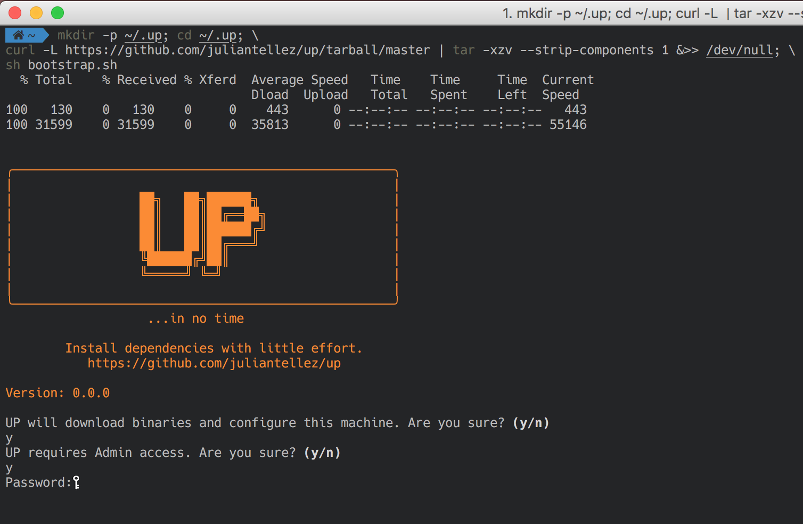
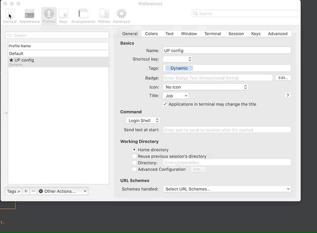

<h1 align="center">UP</h1>

<p align="center">
  <a href="https://github.com/juliantellez/up" target="_blank">
    
  </a>
</p>

<p align="center">
UP is a declarative dotfile configuration.
Its main goal is to increase your productivity whilst keeping track of your dependencies.
Get UP and running in no time, start up your machine with one command!
</p>

- [Install](#install)
- [Tooling](#tooling)
- [Shell](#shell)
- [Languages](#languages)
- [Utilities](#utilities)
- [cli/Binaries](#clibinaries)
- [Browsers](#browsers)
- [Editors](#editors)
- [Databases](#databases)
- [Productivity](#productivity)
- [Apps](#apps)
- [Configuration files](#configuration-files)
- [Mac Configuration](#mac-configuration)
- [Iterm Profile](#iterm-profile)
- [Color Presets](#color-presets)
- [Acknowledgements](#acknowledgements)
- [FAQ](#faq)


# Install

<p align="center">
  <a href="https://github.com/juliantellez/up" target="_blank">
    
  </a>
</p>

Copy the following snippet into your current terminal.

```bash
sh -c "$(curl -fsSL https://raw.githubusercontent.com/juliantellez/up/master/install.sh)"
```

# Tooling

- [Xcode](https://developer.apple.com/xcode/): Installs necessary development tools.
- [Home brew](https://brew.sh/): The missing package manager for macOS (or Linux).
- [git](https://github.com/git/git): A free and open source distributed version control system.

# Shell
- [ohmyz](https://ohmyz.sh/): A delightful, open source, community-driven framework for managing your ZSH configuration.
- [iterm2](https://www.iterm2.com/): A replacement for Terminal.
- [powerlevel9k](https://github.com/Powerlevel9k/powerlevel9k): The most awesome Powerline theme for ZSH around!
- [zsh syntax highlight](https://github.com/zsh-users/zsh-syntax-highlighting): Enables highlighting of commands whilst they are typed.
- [zsh autocomplete](https://github.com/zsh-users/zsh-completions): Completion scripts that are not available in Zsh yet.
- [font-hack-nerd-font](https://github.com/ryanoasis/nerd-fonts): Developer targeted fonts.

# Languages
- [Go](https://github.com/golang/go): Open source programming language that makes it easy to build simple, reliable, and efficient software.
- [Nodejs](https://nodejs.org/en/): A JavaScript runtime built on Chrome's V8 JavaScript engine.
- [Python](https://github.com/python/cpython): An ideal language for scripting and rapid application development in many areas on most platforms.
- [Rust](https://www.rust-lang.org/tools/install): A language empowering everyone to build reliable and efficient software.

# Utilities
- [fzf](https://github.com/junegunn/fzf): General-purpose command-line fuzzy finder.
- [jq](https://github.com/stedolan/jq): A lightweight and flexible command-line JSON processor.
- [htop](https://github.com/hishamhm/htop): An interactive process viewer.
- [hub](https://github.com/github/hub): Commands that make working with GitHub easier.
- [the_silver_searcher](https://github.com/ggreer/the_silver_searcher): A code searching tool similar to ack, with a focus on speed.
- [tree](https://linux.die.net/man/1/tree): A depth indented listing of files.
- [wget](https://github.com/jay/wget): A free utility for non-interactive download of files from the Web.
- [z](https://github.com/rupa/z): Tracks your most used directories, based on 'frecency'.

# cli/Binaries
- [awscli](https://github.com/aws/aws-cli): Unified command line interface to Amazon Web Services.
- [docker](https://github.com/docker/cli): Package Software into Standardized Units for Development, Shipment and Deployment.
- [kops](https://github.com/kubernetes/kops): The easiest way to get a production grade Kubernetes cluster up and running.
- [mas](https://github.com/mas-cli/mas): CLI for the Mac App Store.
- [terraform](https://github.com/hashicorp/terraform): Tool for building, changing, and versioning infrastructure safely and efficiently.
- [vault](https://github.com/hashicorp/vault): tTol for securely accessing secrets.
- [ngrok](https://ngrok.com/): A multiplatform tunnelling and reverse proxy.
- [vagrant](https://www.vagrantup.com/): Development Environments Made Easy.

# Browsers
- [firefox](https://www.mozilla.org/en-US/firefox/): Free and open-source web browser developed by the Mozilla Foundation.
- [google-chrome-canary](https://www.google.com/chrome/canary/): Nightly build for developers.

# Editors
- [visual-studio-code](https://code.visualstudio.com/): Code editor redefined and optimized for building and debugging modern web and cloud applications. 
- [vim](https://github.com/vim/vim): Improved version of the good old UNIX editor Vi.

# Databases
- [postgress](https://www.postgresql.org/): reliable and robust object-relational database.
- [redis](https://redis.io/): in-memory data structure store.

# Productivity
- [caffeine](http://lightheadsw.com/caffeine/):  Click it to prevent your Mac from automatically going to sleep.
- [spectacle](https://www.spectacleapp.com/): Move and resize windows with ease.
- [trailer](https://ptsochantaris.github.io/trailer/): Track pull requests and issues across repositories.
- [day-o](https://shauninman.com/archive/2011/10/20/day_o_mac_menu_bar_clock): Menu bar clock replacement with a simple calendar for your Mac.

# Apps
- [gitter](https://gitter.im/): A chat and networking platform that helps to manage, grow and connect communities through messaging, content and discovery.
- [slack](https://slack.com/): Brings all your communication together.
- [giphy capture](https://giphy.com/apps/giphycapture): The best way to create GIFs on your Mac.
- [canary](https://canarymail.io/): Modern email apps compromise on security or features. Canary does not.
- [spotify](https://www.spotify.com): Music for everyone.

# Configuration files

- [gitconfig](./config/.gitconfig): Get and set global options.
- [gitignore](./config/.gitignore_global): Specifies intentionally untracked files to ignore.
- [zshrc](./config/.zshrc): 'runcom' or 'run commands' for zsh.
- [iterm](./config/iterm.json): Iterm2 profile.

# Mac Configuration
Please read the [configurations](./dependencies/mac.sh) before applying them. Note that you can always reset them by typing:

```
defaults delete <domain>; # sets domain to default settings
killall <domain>; # restarts domain

e.g
defaults delete Dock;
kill all Dock;
```

# Iterm Profile

UP uses a dynamic profile [see](https://www.iterm2.com/documentation-dynamic-profiles.html). To enable it do:

```
Iterm2 >
    Preferences >
        Profiles > UP Config >
            Other Actions > Set as Default
```

<p align="center">
  <a href="https://github.com/juliantellez/up" target="_blank">
    
  </a>
</p>

# Color Presets

Color presets can be downloaded by following [this url](https://github.com/mbadolato/iTerm2-Color-Schemes/blob/master/README.md). Alternatively you can
follow the description below and import them from the color_presets folder.

```
Iterm2 > Preferences > Profiles > Colors > Color Presets > Import
```

# Acknowledgements
These configs and dotfiles stand on the shoulders of the following giants:

- https://github.com/minamarkham/formation
- https://github.com/mathiasbynens/dotfiles
- https://github.com/kevinSuttle/macOS-Defaults

# FAQ

- Have you tested these dotfiles?

  Yes, currently tested on:

  - macOS High Sierra - 10.13.6
  - macOS Mojave - 10.14.6
  - macOS Catalina - 10.15.1
